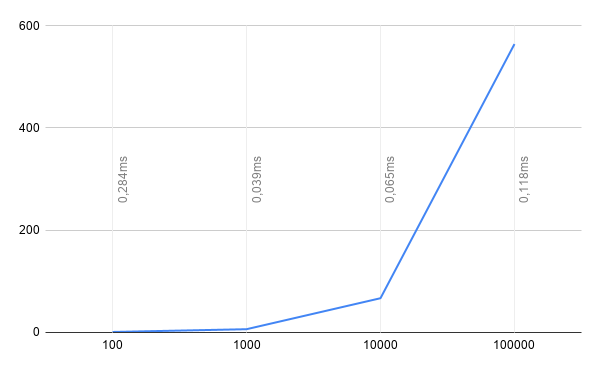
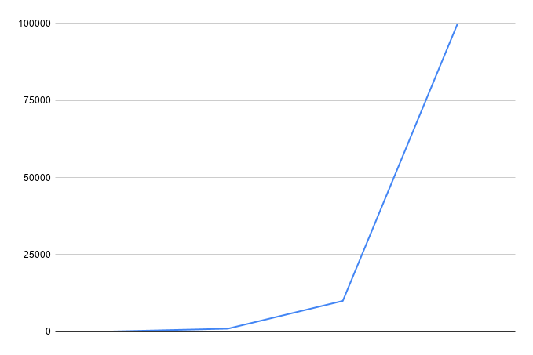
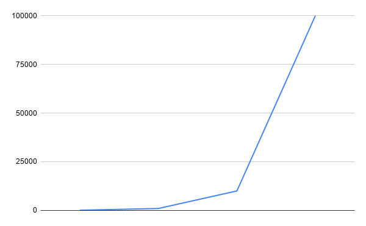
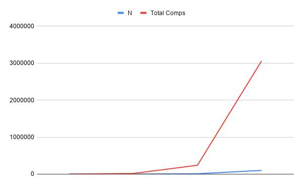

# Assignment 2: Algorithmic Analysis, Correctness and Performance Trade-offs

## 1. Overview
This project presents an empirical and theoretical performance study of three fundamental data structures: **Dynamic Array**, **Singly Linked List**, and **Min-Heap**, implemented from scratch in Java.

The primary objective of this assignment is to compare asymptotic theoretical complexities ($\mathcal{O}, \Omega, \Theta$) with real-world empirical execution times measured under controlled benchmark workloads. Additionally, this report includes rigorous mathematical correctness proofs using loop invariants for core operations.

---

## 2. Complexity Analysis

### Summary Table
| Data Structure | Operation | Best Case | Average Case | Worst Case | Auxiliary Space |
| :--- | :--- | :--- | :--- | :--- | :--- |
| **Dynamic Array** | `get(i)` | $\Omega(1)$ | $\Theta(1)$ | $O(1)$ | $O(1)$ |
| | `add(x)` | $\Omega(1)$ | $\Theta(1)$ | $O(n)$ | $O(1)$ amortized |
| | `add(i, x)` | $\Omega(1)$ | $\Theta(n)$ | $O(n)$ | $O(1)$ |
| | `remove(i)` | $\Omega(1)$ | $\Theta(n)$ | $O(n)$ | $O(1)$ |
| | `contains(x)`| $\Omega(1)$ | $\Theta(n)$ | $O(n)$ | $O(1)$ |
| **Linked List** | `get(i)` | $\Omega(1)$ | $\Theta(n)$ | $O(n)$ | $O(1)$ |
| | `add(x)` | $\Omega(n)$ | $\Theta(n)$ | $O(n)$ | $O(1)$ |
| | `add(i, x)` | $\Omega(1)$ | $\Theta(n)$ | $O(n)$ | $O(1)$ |
| | `remove(i)` | $\Omega(1)$ | $\Theta(n)$ | $O(n)$ | $O(1)$ |
| | `contains(x)`| $\Omega(1)$ | $\Theta(n)$ | $O(n)$ | $O(1)$ |
| **Min-Heap** | `insert(x)` | $\Omega(1)$ | $\Theta(\log n)$ | $O(\log n)$ | $O(1)$ |
| | `peekMin()` | $\Omega(1)$ | $\Theta(1)$ | $O(1)$ | $O(1)$ |
| | `extractMin()`| $\Omega(\log n)$ | $\Theta(\log n)$ | $O(\log n)$ | $O(1)$ |

### Critical Complexity Justifications:
* **Random Access (`get(i)`)**: Dynamic Array provides constant time $O(1)$ operations due to contiguous memory allocation and direct pointer arithmetic (`base_address + index * element_size`). Conversely, Linked List requires sequential node traversal from the head, yielding an $O(n)$ worst-case time complexity.
* **Head Insertion (`add(0, x)`)**: Linked List completes head insertions in $O(1)$ constant time by adjusting reference pointers (`newNode.next = head`). Dynamic Array requires shifting all $n$ existing elements right by one position, resulting in $O(n)$ time complexity.

---

## 3. Correctness Proofs (Loop Invariants)

### Proof 1: Linear Search in Dynamic Array (`contains(x)`)
* **Loop Invariant**: At the start of each iteration $i$ ($0 \le i \le \text{size}$), the target value $x$ is not present in the subarray `data[0 .. i-1]`.
* **Initialization**: Prior to the first iteration ($i = 0$), the subarray `data[0 .. -1]` is empty. Thus, $x$ cannot exist in it, making the invariant trivially true.
* **Maintenance**: Assume the invariant holds for index $i$. During iteration $i$, the algorithm compares `data[i]` with $x$:
  * If `data[i] == x`, the algorithm returns `true`, which is correct.
  * If `data[i] != x`, the loop increments $i$ to $i + 1$. Because $x \notin \text{data}[0 .. i-1]$ (by assumption) and $x \neq \text{data}[i]$, $x \notin \text{data}[0 .. i]$. The invariant holds for $i + 1$.
* **Termination**: The loop terminates when $i = \text{size}$.
* **Correctness**: At termination, $i = \text{size}$, proving $x \notin \text{data}[0 .. \text{size}-1]$. Returning `false` accurately confirms the absence of $x$.

### Proof 2: Min-Heap Rebalancing (`siftUp(index)`)
* **Loop Invariant**: For every node $k \neq \text{index}$ in the heap array, the min-heap property holds ($\text{heap}[k] \ge \text{heap}[(\text{k}-1)/2]$). The only possible violation is between node $\text{index}$ and its immediate parent.
* **Initialization**: Before `siftUp` is invoked, a new element is appended at position $\text{size}-1$. All existing parent-child relationships satisfy the min-heap condition. The invariant holds.
* **Maintenance**: If `heap[index] < heap[parent]`, the elements are swapped. This operation restores the heap property for the subtree rooted at `index`. The potential violation moves up to the parent node. Reassigning $\text{index} = parent$ preserves the invariant for the next iteration.
* **Termination**: The loop terminates when $\text{index} == 0$ (root reached) or `heap[index] >= heap[parent]`.
* **Correctness**: Upon termination, no violation exists anywhere in the heap tree. The structure maintains a valid Min-Heap.

---

## 4. Experimental Setup
* **Input Sizes ($N$)**: 100, 1,000, 10,000, 100,000.
* **Workload Repetitions**: 5 independent runs per workload scenario; reported values represent the arithmetic mean.
* **Timing Method**: `System.nanoTime()` measured strictly around operational loops (input generation excluded).
* **Random Seed**: `Random(42 + run)` used for deterministic input generation across implementations.

---

## 5. Results

### Workload 1: Random Access
Evaluating 10,000 random `get(index)` operations as $N$ scales.

### Workload 2: Search
Evaluating 1,000 `contains(val)` lookups across $N$ elements.

### Workload 3: Insertion and Removal
Evaluating 1,000 insertions and deletions at index $0$ vs index $N/2$.

### Workload 4: Priority Processing
Evaluating $N$ sequential `insert` operations followed by $N$ `extractMin` extractions in Min-Heap.

---

## 6. Discussion & Analysis

1. **Impact of Scaling $N$**: As $N$ increased to 100,000, operations requiring sequential access or memory shifts (such as `LinkedList.get(i)` and `DynamicArray.add(0, x)`) degraded rapidly. Operations scaling at $O(1)$ or $O(\log n)$ maintained sub-millisecond to low-millisecond execution times.
2. **Theory vs. Empirical Results**: Theoretical asymptotic models matched empirical observations closely in terms of curve shapes. However, linear search (`contains`) on Dynamic Array performed **up to 10x faster** than on Linked List despite both having $O(n)$ complexity.
3. **Hardware & Implementation Effects**: The discrepancy between Array and Linked List performance stems from CPU Cache Locality. Dynamic Arrays store elements in contiguous memory blocks, triggering efficient CPU L1/L2 cache prefetching. Linked Lists use heap-allocated node pointers scattered across memory, causing frequent **cache misses** and memory bus latency.
4. **Constant Factors**: Although `System.arraycopy` in Dynamic Array operates in $O(n)$ time, its underlying native C/assembly implementation shifts memory blocks via SIMD vector instructions, making array shifts significantly faster than traversing linked list references node-by-node.

---

## 7. Design Recommendations

1. **Choose Dynamic Array when**:
   * The workload is read-heavy or relies heavily on random access by index (`get(i)`).
   * Appends primarily occur at the end of the structure.
   * Maximum cache efficiency and low memory overhead per element are required.

2. **Choose Linked List when**:
   * Elements are frequently inserted or removed at the head (`index = 0`).
   * The application requires sequence modifications without memory reallocation penalties.

3. **Choose Min-Heap when**:
   * The system requires continuous dynamic retrieval of minimum (or maximum) elements.
   * Implementing priority queues, task schedulers, or pathfinding algorithms (e.g., Dijkstra).

---

## 8. Conclusion
The experimental findings confirm that theoretical Big-O analysis accurately predicts algorithmic scaling behaviors. However, real-world execution speed is heavily modulated by CPU hardware architectures, spatial locality, and implementation details. Choosing the appropriate data structure must depend on workload characteristics (read vs. write balance, insertion positions) rather than theoretical complexity alone.
